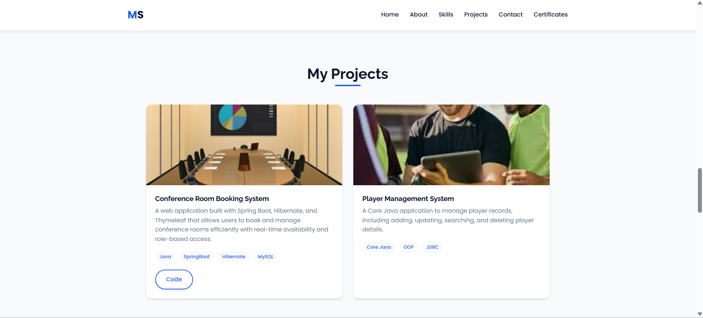

# MY-PORTFOLIO

🌐 **Mahesh Sanap - Portfolio**  

This is my personal **Portfolio Website** showcasing my skills, projects, and achievements as a **Java Full Stack Developer**.  
It highlights my experience in backend and frontend technologies, along with featured projects like the **Conference Room Booking System** and **Player Management System**.  

---

## 🚀 Features  

- 📌 About Me section with career summary  
- 💻 Skills (Java, Spring Boot, Hibernate, MySQL, HTML, CSS, JavaScript, Git, GitHub)  
- 📂 Projects Showcase with GitHub links  
- 📜 Certificates for professional courses  
- ✉️ Contact Form with validation  
- 📱 Responsive Design for mobile & desktop  
- 🌙 Smooth UI with animations and transitions  

---

## 🛠️ Built With  

- **Frontend:** HTML5, CSS3, JavaScript  
- **Styling:** Flexbox, CSS Grid, Responsive Design  
- **Icons:** Font Awesome  
- **Fonts:** Google Fonts (Poppins, Raleway)  
- **Hosting:** Netlify  

---

## 📸 Screenshots  

### 🏠 Home Page  
  

### 💻 Projects Section  
  

---

## 📂 Projects Featured  

### 1. Conference Room Booking System  
- Built with Spring Boot, Hibernate, Thymeleaf, MySQL  
- Real-time room booking with role-based access  
- [🔗 View Code](https://github.com/SanapMahesh/Conference_Room_Booking_SpringBoot)  

### 2. Player Management System  
- Core Java + JDBC application  
- Manage player records with CRUD operations  

---

## 📜 Certificates  

- Java Full Stack Development – FirstBit Solution  
- C++ Programming Essentials – LetsUpgrade  
- 3-Day Java Bootcamp – LetsUpgrade  

---

## 📬 Contact  

- 📧 Email: [sanapmahesh27@gmail.com](mailto:sanapmahesh27@gmail.com)  
- 💼 LinkedIn: [Mahesh Sanap](https://www.linkedin.com/in/mahesh-sanap-software-developer/)  
- 🌐 Portfolio: [maheshsanap.netlify.app](https://maheshsanap.netlify.app)  

---

## 📌 How to Run  

```bash
# Clone the repository  
git clone https://github.com/SanapMahesh/portfolio.git
cd portfolio

# Open index.html in your browser
```

---

## 📝 License  

This project is open-source and available under the [MIT License](LICENSE).  
